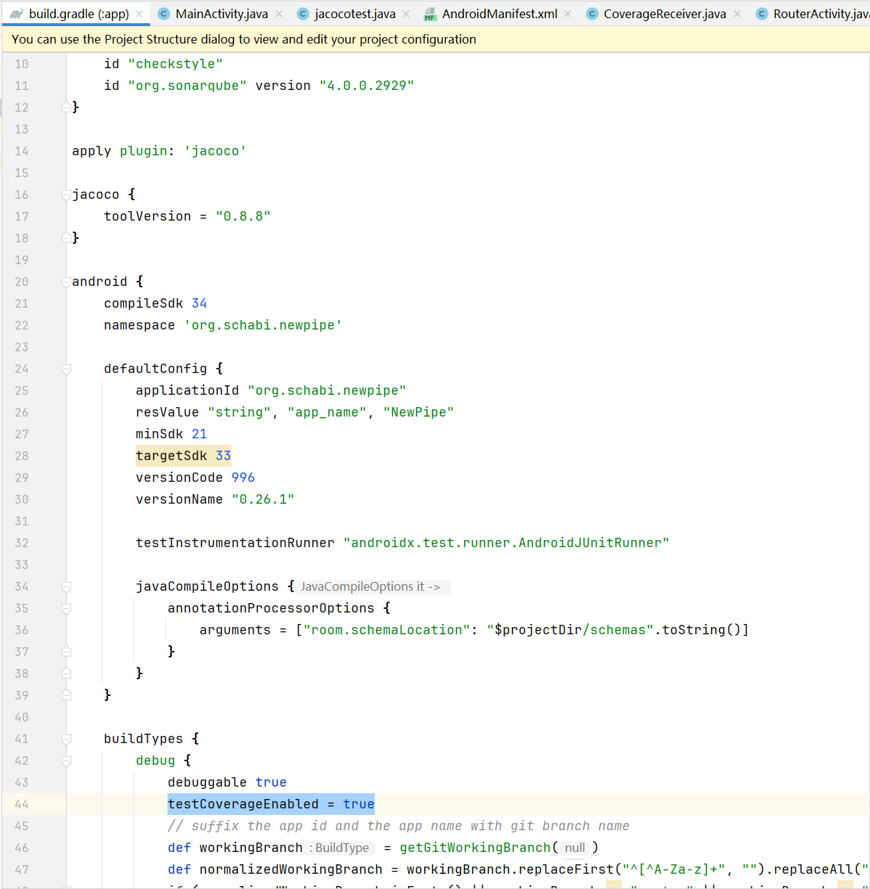

# How to Instrument an APP

## AndroLog

See the [Androlog Github](https://github.com/JordanSamhi/AndroLog)

## JaCoCo

The following steps demonstrate how to modify an open-source app (using NewPipe as an example) to make it compatible with LLMDroid using JaCoCo instrumentation:

1. **Modify `build.gradle`** (in `app` directory)

    1. Add the JaCoCo plugin by inserting this code at the beginning of the file

        ```java
        apply plugin: 'jacoco'
        
        jacoco {
            toolVersion = "0.8.8"
        }
        ```

    2. Add **`testCoverageEnabled = true`** under `android` → `buildTypes` → `debug` as shown below:

        

2. **Create a BroadcastReceiver**. Create a new `CoverageReceiver.java` file in the project's source directory with the following code:

    ```java
    package org.schabi.newpipe;
    
    import android.content.BroadcastReceiver;
    import android.content.Context;
    import android.content.Intent;
    import android.util.Log;
    
    import java.io.FileOutputStream;
    import java.io.IOException;
    import java.io.OutputStream;
    import android.os.Environment;
    import java.nio.file.Paths;
    
    public class CoverageReceiver extends BroadcastReceiver {
        private static final String TAG = "CoverageReceiver";
    
        private final String ecFileDir;     // /data/data/org.schabi.newpipe.debug
        //Environment.getExternalStorageDirectory().getPath();
    
        public CoverageReceiver(String storageDir) {
            super();
            ecFileDir = storageDir;
        }
    
        @Override
        public void onReceive(Context context, Intent intent) {
            // check Intent's Action
            if ("com.llmdroid.jacoco.COLLECT_COVERAGE".equals(intent.getAction())) {
                Log.i(TAG, "Received coverage collection broadcast");
    
                // get extra data in broadcast
                String coverageFilePath = intent.getStringExtra("coverageFile");
                if (coverageFilePath != null) {
                    // generate ec file path
                    coverageFilePath = ecFileDir + "/" + coverageFilePath;
                    Log.i(TAG, "Coverage file name: " + coverageFilePath);
                }
                else {
                    coverageFilePath = ecFileDir + "/newpipe_coverage.ec";
                }
                OutputStream out = null;
                try {
                    long startTime = System.nanoTime();
                    out = new FileOutputStream(coverageFilePath, true);
                    Object agent = Class.forName("org.jacoco.agent.rt.RT")
                            .getMethod("getAgent")
                            .invoke(null);
                    out.write((byte[]) agent.getClass().getMethod("getExecutionData", boolean.class)
                            .invoke(agent, true));
                    Log.i(TAG, "write coverage.ec to:" + coverageFilePath);
                    long endTime = System.nanoTime();
                    double durationInSeconds = (endTime - startTime) / 1_000_000_000.0;
                    Log.d(TAG, "Cost: " + durationInSeconds + " seconds");
                } catch (Exception e) {
                    Log.e(TAG, e.toString());
                    e.printStackTrace();
                } finally {
                    if (out != null) {
                        try {
                            out.close();
                        } catch (IOException e) {
                            e.printStackTrace();
                        }
                    }
                }
            }
        }
    }
    
    ```

    This BroadcastReceiver implementation will:

    - Read the `coverageFile` value from the broadcast intent as the filename
    - Generate an EC file using this name
    - Use reflection to call JaCoCo's runtime methods and write coverage data to the EC file
    - Save the file to the path provided during class initialization (recommended to use `getExternalFilesDir(null).getPath()`)

3. **Register BroadcastReceiver.** Register the receiver in the `onCreate()` method of the app's launch Activity (MainActivity in this case):

    ```java
    IntentFilter filter = new IntentFilter("com.llmdroid.jacoco.COLLECT_COVERAGE");
    receiver = new CoverageReceiver(this.getExternalFilesDir(null).getPath());
    this.registerReceiver(receiver, filter);
    ```

    Note: The IntentFilter value must match the one used in JacocoBridge. If modified here, you must update it in JacocoBridge accordingly.

4. **Unregister in onDestroy()**

    ```java
    unregisterReceiver(receiver);
    ```

Your app is now ready to generate EC files automatically upon receiving broadcasts!

---

You can manually test the instrumentation using ADB:

```shell
adb shell am broadcast -a com.llmdroid.jacoco.COLLECT_COVERAGE --es coverageFile ec_filename.ec
```

Alternatively, use the JAR from JacocoBridge to automatically send periodic broadcasts for real-time coverage collection. See [JacocoBridge Documentation](../JacocoBridge/README.md) for usage instructions.

